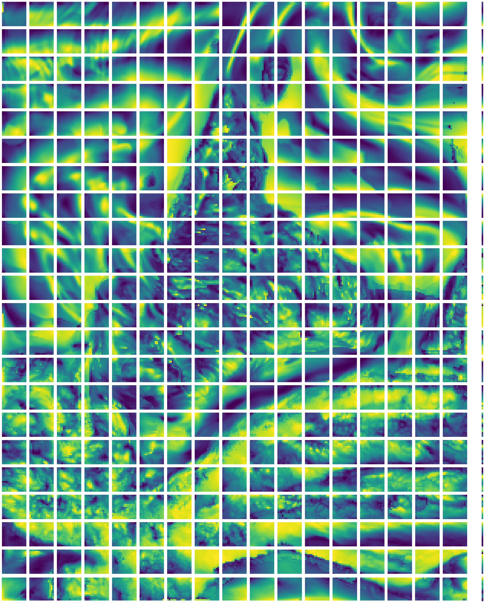

# 🌌 Atmospheric Downsampling with Super Resolution 🌌

## 🚀 Overview

Welcome to the **Atmospheric Downsampling** repository! Here, we tackle the challenging problem of downsampling atmospheric data by formulating it as a super-resolution problem using state-of-the-art Machine Learning and Deep Learning techniques. Our innovative approach enhances data resolution, paving the way for more accurate environmental predictions and analyses.

## 📚 Table of Contents

- [Introduction](#introduction)
- [Methodology](#-methodology)
- [Installation](#installation)
- [Usage](#usage)
- [Results](#results)
- [Future Work](#future-work)
- [Contributing](#contributing)
- [License](#license)
- [Acknowledgements](#acknowledgements)

## 🌍 Introduction

Atmospheric data is crucial for understanding climate patterns, weather forecasting, and environmental monitoring. However, downsampling this data can lead to loss of critical information. This project leverages the power of super-resolution techniques to enhance the resolution of atmospheric data, ensuring detailed and accurate representations.

## 🧠 Methodology
### 01. Chunking
The preprocessing pipeline is embedded in the [dataloading script](02-dataloading.py). The preprocessing steps taken were as follows:
- The input data was shaped as a 4 dimensional array. The dimensions were ```(N1 variables, N2 time points, N3 latituude points, N4 longitude points)```. 
- The data was min-max scaled to the range [0, 1]. This was done to ensure that the data was within the range of the activation functions used in the neural network. Standard scaling was not used as the data was not normally distributed.
- The data was broken down into ```P x P ``` chunks in the dataloader class. So, the final shape of the data was ```(P, N1, N2, N3/P, N4/P)```.

The following figure shows a chunked representation of the data. The data is broken down into 16x16 chunks. 


### 02. Min-Max Scaling of Multidimensional Data

Min-max scaling, also known as normalization, is a technique used to transform data values to a specified range, typically [0, 1]. This process ensures that different features contribute proportionally during model training, improving the performance and convergence of machine learning algorithms. 

In this implementation, we applied min-max scaling to a multidimensional dataset with the shape `(N_VARIABLES, N_TIME_POINTS, N_LAT, N_LONG)`. The scaling is performed independently for each variable and each time point across the spatial dimensions (latitude and longitude).


For a given data value \( x \) within the dataset, the min-max scaling transformation is defined as:

\[ x' = \frac{x - x_{\min}}{x_{\max} - x_{\min}} \]

where:
- \( x \) is the original data value.
- \( x_{\min} \) is the minimum value in the original data.
- \( x_{\max} \) is the maximum value in the original data.
- \( x' \) is the transformed data value in the range [0, 1].
.

#### Example Code

Here is the code implementation of the min-max scaling process:

```python


class MinMaxScaleTransform:
    def __init__(self, high_res_data, low_res_data, use_half=False):
        """ Initialize the min-max scaling transform.
        Args:
            high_res_data (np.ndarray): High-resolution data with shape (N_VARIABLES, N_TIME_POINTS, N_LAT, N_LONG).
            low_res_data (np.ndarray): Low-resolution data with shape (N_VARIABLES, N_TIME_POINTS, N_LAT, N_LONG).
            use_half (bool): Whether to use half-precision (float16) for the transformed data.
        """
        self.use_half = use_half
        
        # Compute min and max for each variable at each time point using numpy
        self.high_res_mins = np.amin(high_res_data, axis=(2, 3), keepdims=True)
        self.high_res_maxs = np.amax(high_res_data, axis=(2, 3), keepdims=True)
        self.low_res_mins = np.amin(low_res_data, axis=(2, 3), keepdims=True)
        self.low_res_maxs = np.amax(low_res_data, axis=(2, 3), keepdims=True)

    def __call__(self, sample):
        high_res, low_res = sample
        dtype = np.float16 if self.use_half else np.float32
        
        # Min-max scale each variable independently using broadcasting
        if isinstance(high_res, torch.Tensor):
            high_res = high_res.numpy()
        if isinstance(low_res, torch.Tensor):
            low_res = low_res.numpy()
        
        high_res = (high_res - self.high_res_mins) / (self.high_res_maxs - self.high_res_mins)
        low_res = (low_res - self.low_res_mins) / (self.low_res_maxs - self.low_res_mins)
        
        return torch.tensor(high_res, dtype=dtype), torch.tensor(low_res, dtype=dtype)
```